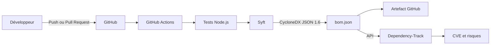

# Sécurité de la chaîne d'approvisionnement avec Syft et Dependency-Track

Automatisation de la génération et de l'analyse d'un **SBOM CycloneDX** avec **Syft**, **OWASP Dependency-Track**, **Docker Compose** et **GitHub Actions**.

Ce projet contient une petite API Node.js dont les dépendances sont inventoriées automatiquement par Syft. Le fichier `bom.json` obtenu est conservé comme artefact du pipeline puis envoyé à Dependency-Track, qui centralise les composants, les licences et les vulnérabilités connues.

## Aperçu du tableau de bord Dependency-Track

<!-- Insérer ici la capture d'écran du tableau de bord Dependency-Track. -->

## Problématique

Une application moderne s'appuie sur de nombreux composants open source et dépendances transitives. Sans inventaire précis, une bibliothèque vulnérable peut rester intégrée au logiciel sans être identifiée rapidement.

Une analyse ponctuelle ne suffit pas : une dépendance considérée comme sûre aujourd'hui peut être associée à une nouvelle CVE plusieurs semaines plus tard. Il est donc nécessaire de produire un inventaire standardisé et de le surveiller continuellement.

## Solution apportée

Ce projet met en place une chaîne automatisée et reproductible :

- **GitHub Actions** teste l'application après chaque modification ;
- **Syft** analyse le projet et génère un SBOM au format CycloneDX JSON 1.6 ;
- **GitHub Actions** conserve le SBOM comme artefact pendant 30 jours ;
- **Dependency-Track** reçoit le SBOM et crée automatiquement le projet si nécessaire ;
- **Dependency-Track** corrèle les composants avec les sources de vulnérabilités et présente les risques dans son tableau de bord.

Les versions d'Express et de Lodash utilisées dans cette démonstration sont volontairement anciennes. Elles permettent d'obtenir des vulnérabilités visibles dans Dependency-Track. Ces versions ne doivent pas être utilisées dans une application de production.

## Architecture



| Composant | Fonction | Accès |
|---|---|---|
| API Node.js | Application de démonstration analysée par Syft | `http://localhost:3000` |
| Syft | Génère l'inventaire des composants logiciels | Ligne de commande / CI |
| Dependency-Track API | Importe et analyse les SBOM | `http://localhost:8081` |
| Dependency-Track Frontend | Affiche les composants, licences et vulnérabilités | `http://localhost:8080` |
| GitHub Actions | Automatise les tests, la génération et la publication | Onglet **Actions** du dépôt |

## Prérequis

- Node.js 22 ou supérieur ;
- npm 10 ou supérieur ;
- Docker Desktop avec Docker Compose ;
- au moins 2 Go de mémoire disponible pour Dependency-Track ;
- un compte GitHub pour exécuter le pipeline ;
- Syft, uniquement pour générer manuellement le SBOM en local.

## Installation de l'application

Installez les dépendances puis exécutez les tests :

```bash
npm ci
npm test
```

Lancez ensuite l'API :

```bash
npm start
```

Les routes suivantes permettent de vérifier son fonctionnement :

| Route | Description |
|---|---|
| [http://localhost:3000/health](http://localhost:3000/health) | État de santé de l'API |
| [http://localhost:3000/api/components](http://localhost:3000/api/components) | Exemple de réponse contenant des composants |

## Déploiement de Dependency-Track

Validez la configuration puis démarrez les services :

```bash
docker compose config
docker compose up -d
docker compose ps
```

Le premier démarrage peut prendre plusieurs minutes. Les interfaces sont ensuite disponibles aux adresses suivantes :

| Service | URL |
|---|---|
| Interface Dependency-Track | [http://localhost:8080](http://localhost:8080) |
| API Dependency-Track | [http://localhost:8081](http://localhost:8081) |

Les identifiants initiaux sont `admin` / `admin`. Dependency-Track demande de modifier le mot de passe lors de la première connexion.

## Génération locale du SBOM

Après avoir installé [Syft](https://github.com/anchore/syft#installation), exécutez :

```bash
syft scan dir:. \
  --source-name syft-sbom-demo \
  --source-version 1.0.0 \
  -o cyclonedx-json@1.6=bom.json
```

Le fichier produit respecte le standard **CycloneDX JSON 1.6** et peut être importé manuellement avec le bouton **Upload BOM** de Dependency-Track.

Le SBOM d'exemple présent dans ce dépôt contient notamment :

| Composant | Version | Rôle |
|---|---:|---|
| Express | `4.17.1` | Framework HTTP de l'API |
| Lodash | `4.17.20` | Fonctions utilitaires JavaScript |
| Syft | `1.51.0` | Générateur du SBOM |

## Pipeline CI/CD

Le workflow [`.github/workflows/sbom.yml`](.github/workflows/sbom.yml) est déclenché :

- lors d'un push sur `main` ;
- lors d'une pull request vers `main` ;
- manuellement depuis l'onglet **Actions**.

Il exécute les étapes suivantes :

1. récupération du dépôt ;
2. installation de Node.js et des dépendances ;
3. exécution des tests automatisés ;
4. installation de Syft ;
5. génération de `bom.json` au format CycloneDX 1.6 ;
6. publication du SBOM comme artefact GitHub ;
7. envoi à Dependency-Track lorsque les secrets sont disponibles.

Les pull requests produisent un SBOM, mais ne l'envoient pas à Dependency-Track afin de ne pas exposer les secrets aux contributions externes.

## Configuration des secrets GitHub

Dans **Settings > Secrets and variables > Actions**, créez les secrets suivants :

| Secret | Description | Exemple |
|---|---|---|
| `DTRACK_HOSTNAME` | Nom d'hôte de Dependency-Track, sans protocole | `dtrack.exemple.fr` |
| `DTRACK_API_KEY` | Clé API de l'équipe d'automatisation | `odt_...` |
| `DTRACK_PROTOCOL` | Protocole utilisé | `https` |
| `DTRACK_PORT` | Port de l'API | `443` |

La clé API doit appartenir à une équipe disposant au minimum des permissions `BOM_UPLOAD` et `PROJECT_CREATION_UPLOAD`.

### Instance locale et runner GitHub

Une instance disponible sur `localhost:8081` n'est pas accessible depuis un runner GitHub hébergé : dans le pipeline, `localhost` désigne le runner et non votre ordinateur.

Pour automatiser l'import vers une instance locale, vous pouvez :

- installer un runner GitHub auto-hébergé sur la machine qui exécute Dependency-Track ;
- exposer Dependency-Track derrière une URL HTTPS sécurisée ;
- relier le runner au réseau privé à l'aide d'un VPN ou d'un tunnel sécurisé.

Si les secrets ne sont pas configurés, le workflow génère et conserve quand même le SBOM, puis ignore proprement l'étape d'envoi.

## Résultats attendus

Après l'import du SBOM, Dependency-Track permet de consulter :

- la liste complète des composants directs et transitifs ;
- les versions et identifiants Package URL des bibliothèques ;
- les licences détectées ;
- les CVE classées par niveau de sévérité ;
- le score de risque du projet ;
- les recommandations de versions plus récentes ;
- l'évolution des vulnérabilités au fil des nouveaux imports.

La première synchronisation des sources de vulnérabilités peut prendre du temps. Les résultats apparaissent progressivement dans les onglets **Components**, **Audit Vulnerabilities** et **Policy Violations**.

## Fichiers principaux

| Fichier | Rôle |
|---|---|
| `src/app.js` | Définit les routes de l'API Node.js |
| `src/server.js` | Démarre le serveur HTTP |
| `test/app.test.js` | Vérifie automatiquement les routes de l'API |
| `package.json` | Déclare les dépendances analysées par Syft |
| `package-lock.json` | Verrouille les versions directes et transitives |
| `Dockerfile` | Construit l'image de l'application de démonstration |
| `docker-compose.yml` | Déploie l'API et l'interface de Dependency-Track |
| `.syft.yaml` | Configure l'analyse Syft |
| `.github/workflows/sbom.yml` | Automatise les tests et la publication du SBOM |
| `bom.json` | Exemple de SBOM CycloneDX généré |
| `screenshots/` | Contient les captures destinées au portfolio |

## Arrêt des services

```bash
docker compose down
```

Le volume Docker conserve les données de Dependency-Track entre deux démarrages. Pour éviter toute perte, ne supprimez pas ce volume si vous souhaitez conserver les projets, analyses et utilisateurs.

## Technologies utilisées

- Node.js et Express ;
- Syft ;
- CycloneDX ;
- OWASP Dependency-Track ;
- Docker et Docker Compose ;
- GitHub Actions.

## Licence

Ce projet de démonstration est distribué sous licence MIT.
